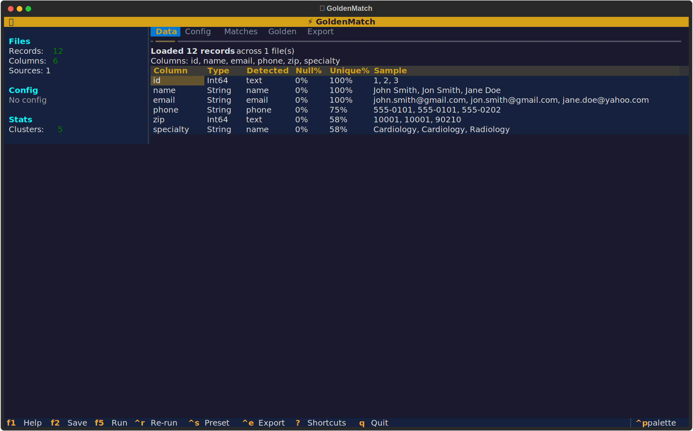
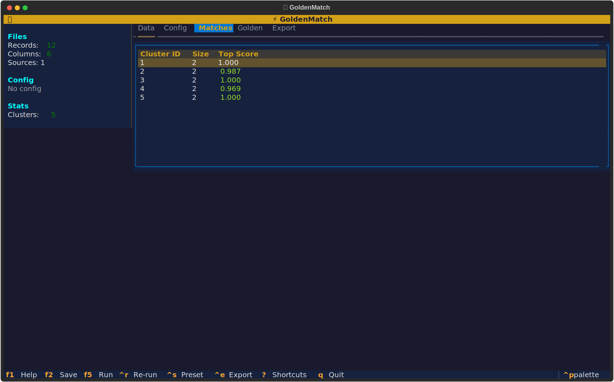

# Interactive TUI

GoldenMatch includes a professional terminal UI built with [Textual](https://textual.textualize.io/), featuring a gold/amber theme and keyboard-driven workflows.





## Launching the TUI

```bash
# Zero-config: auto-detects columns, shows summary screen
goldenmatch dedupe customers.csv

# With config: goes straight to tabbed view
goldenmatch dedupe customers.csv --config config.yaml

# Interactive mode (explicit)
goldenmatch interactive customers.csv
```

## Auto-Config Summary Screen

When running without a config file, the TUI shows a summary of auto-detected columns before anything else:

```
┌─────────────────────────────────────────────────────┐
│  ⚡ GoldenMatch                                     │
│                                                     │
│  Auto-Detected Configuration                        │
│                                                     │
│  File: customers.csv                                │
│  Records: 12,847 │ Columns: 8                       │
│                                                     │
│  Column    Type     Scorer       Weight              │
│  name      Name     ensemble     1.0                 │
│  email     Email    exact        1.0                 │
│  phone     Phone    exact        0.8                 │
│  zip       Zip      exact        0.5                 │
│                                                     │
│  Blocking: multi_pass (soundex + substring)         │
│  Threshold: 0.80 (adaptive)                         │
│                                                     │
│  [▶ Run]  [Edit Config]  [Save Settings]            │
└─────────────────────────────────────────────────────┘
```

- **Run (F5)**: Start matching immediately
- **Edit Config (E)**: Switch to config editor to adjust
- **Save Settings (S)**: Save detected config to `.goldenmatch.yaml` for next run

## Tabs

The main view has 5 tabs:

| Tab | Key | Contents |
|-----|-----|----------|
| **Data** | `1` | File info, column profiling, data types, null rates |
| **Config** | `2` | Matchkey builder, field selection, scorer/weight configuration |
| **Matches** | `3` | Split-view: cluster list + golden record detail |
| **Golden** | `4` | All golden records with confidence scores |
| **Export** | `5` | Save config, save preset, run full job with output options |

## Matches Split View

The Matches tab uses a master-detail layout:

```
┌──────────────────────┬──────────────────────────────────┐
│ Clusters (1,247)     │ Cluster #42                      │
│                      │ Score: 0.94 avg │ 3 records      │
│ ▸ #42  3rec  0.94   │                                  │
│   #107 2rec  0.91   │ Golden Record                    │
│   #23  4rec  0.88   │  name: John Smith                │
│   ...               │  email: john@test.com            │
│                      │                                  │
│                      │ Members                          │
│                      │  John Smith  john@test.com       │
│                      │  Jon Smith   jon@test.com        │
│                      │  J. Smith    js@test.com         │
└──────────────────────┴──────────────────────────────────┘
```

- Arrow keys navigate the cluster list
- Enter selects a cluster to view detail
- Fields that differ across members are highlighted in amber
- Fields that match are shown in green

## Progress Indicators

### First Run — Full-Screen Overlay

Shows the complete pipeline with stage-by-stage tracking:

```
         Matching in progress...

  ████████████████░░░░░░░░░░  62%

  Stage: Scoring fuzzy pairs
  Pairs: 1,247 found
  Elapsed: 4.2s

  Pipeline:
  ✓ Ingest          0.1s
  ✓ Auto-fix        0.3s
  ✓ Standardize     0.2s
  ● Scoring         4.2s
  ○ Clustering
  ○ Golden records
```

### Re-Run — Footer Bar

When re-running after adjusting config, a non-intrusive footer bar shows progress while keeping current results visible:

```
Re-running... ████████░░░░ 45% │ Scoring │ 2.1s
```

## Threshold Slider

In the Config tab, the threshold widget allows live adjustment:

```
Threshold: ◀ 0.80 ▶  ████████████████░░░░  ~1,247 clusters
```

- `←` / `→` arrow keys adjust by 0.05
- Cluster count updates instantly (uses cached scores, no re-matching)
- Based on `recluster_at_threshold()` in MatchEngine

## Keyboard Shortcuts

Press `?` to see all shortcuts:

### Global

| Key | Action |
|-----|--------|
| `1-5` | Jump to tab |
| `F5` | Run / re-run matching |
| `F2` | Save config to `.goldenmatch.yaml` |
| `Ctrl+R` | Re-run matching |
| `Ctrl+S` | Save as preset |
| `Ctrl+E` | Quick export |
| `?` | Show shortcut help |
| `Q` | Quit |

### Matches Tab

| Key | Action |
|-----|--------|
| `↑/↓` | Navigate cluster list |
| `Enter` | Select cluster for detail |
| `/` | Focus filter box |
| `S` | Cycle sort (score → size → ID) |

## Theme

GoldenMatch uses a custom gold/amber theme:

- **Background**: Deep navy (`#1a1a2e`)
- **Panels**: Dark blue-grey (`#16213e`)
- **Accent**: Gold (`#d4a017`)
- **Success**: Green (`#2ecc71`)
- **Warning**: Amber (`#e67e22`)
- **Error**: Red (`#e74c3c`)

The theme is applied consistently across all widgets: headers, tabs, tables, buttons, inputs, and progress bars.

## Sidebar

The persistent left sidebar shows:

- **Files**: Record count, column count, source files
- **Config**: Active matchkeys with types and thresholds
- **Stats**: Clusters found, match rate, singletons, max cluster size

Stats update automatically after each matching run.
